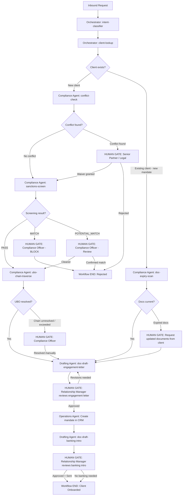

# Workflow Specification: Client Onboarding

**Version**: 1.0.0
**Status**: DRAFT
**Layer**: L4 — Skill & Workflow Layer
**Created**: 2026-04-29
**Owner**: Operations / AI Lead
**Roadmap Ref**: Deliverable #13 — Phase 3 (Weeks 7–10)

---

## 1. Workflow Identity
- **Name**: `client-onboarding`
- **Trigger**: New client engagement request received via any L6 channel (chat, email, API).
- **End State**: Client fully onboarded with mandate active in CRM, or rejected with documented reason.
- **SLA**: Complete within 5 business days (excluding external dependencies like bank responses).

---

## 2. Workflow Diagram



---

## 3. Step-by-Step Specification

| Step | Agent | Skill / Action | Input | Output | Decision Gate | Error Path |
|---|---|---|---|---|---|---|
| 1 | Orchestrator | `intent-classifier` | Raw inbound message | `intent_label: COMPLIANCE` (onboarding detected) | If ambiguous → Human Intake Officer | Retry classification |
| 2 | Orchestrator | `client-lookup` | Client name/ID from message | Client profile or NOT_FOUND | If NOT_FOUND → collect details from user | Prompt user for details |
| 3 | Compliance Agent | `conflict-check` | New client profile (directors + UBOs) | PROCEED / PROCEED_WITH_WAIVER / BLOCK | **HUMAN GATE**: All results reviewed by Compliance Officer. BLOCK → Senior Partner | Cannot proceed without check |
| 4 | Compliance Agent | `sanctions-screen` | Each director + UBO individually | PASS / MATCH / POTENTIAL_MATCH per person | **HUMAN GATE**: MATCH → immediate block. POTENTIAL_MATCH → manual review | API down → block onboarding |
| 5 | Compliance Agent | `ubo-chain-traverse` | Primary legal entity ID | UBO list with ownership paths | **HUMAN GATE**: Chain >3 hops or unresolved → Compliance Officer review | Graph missing data → manual UBO identification |
| 6 | Compliance Agent | `doc-expiry-scan` | Client entity IDs | List of expired/expiring docs | If expired → request updated docs from client before proceeding | Flag and continue with caveats |
| 7 | Drafting Agent | `doc-draft-engagement-letter` | Client ID + service type + mandate details | Engagement letter draft (DOCX) | **HUMAN GATE**: Relationship Manager reviews and approves | Missing data → pause; request from RM |
| 8 | Operations Agent | CRM write | Approved mandate details | Mandate record created in Salesforce | Auto-approved (internal record) | CRM write failure → queue and retry |
| 9 | Drafting Agent | `doc-draft-banking-intro` | Client ID + target bank | Banking intro letter draft (DOCX) | **HUMAN GATE**: Relationship Manager reviews and sends | Skip if no banking intro needed |

---

## 4. Human Gates Summary

| Gate # | Step | Reviewer | Decision Options | SLA |
|---|---|---|---|---|
| HG-1 | Conflict check result | Compliance Officer (all) / Senior Partner (if BLOCK) | Proceed / Waiver / Reject | 1 business day |
| HG-2 | Sanctions MATCH | Compliance Officer | Block confirmed / False positive (rare) | Immediate (< 4 hours) |
| HG-3 | Sanctions POTENTIAL_MATCH | Compliance Officer | Clear / Escalate / Block | 1 business day |
| HG-4 | UBO chain unresolved | Compliance Officer | Resolve manually / Request more info | 2 business days |
| HG-5 | Expired documents | Relationship Manager | Request docs from client | 3 business days |
| HG-6 | Engagement letter review | Relationship Manager | Approve / Request revisions | 1 business day |
| HG-7 | Banking intro review | Relationship Manager | Approve and send / Skip | 1 business day |

---

## 5. Error Handling

| Error Scenario | Handling | Retry? | Human Escalation |
|---|---|---|---|
| Sanctions API unavailable | Block onboarding entirely — no auto-pass | Yes (3 retries, exponential backoff) | Compliance Officer must manually screen |
| GraphRAG unavailable | Pause at Steps 3/5/6 — cannot proceed without graph | Yes | Data Engineer alerted |
| CRM write failure | Queue write operation — mandate creation delayed | Yes (infinite retry with backoff) | Operations Manager after 3 failures |
| Template not found | Pause drafting — escalate to Operations Manager | No | Operations Manager uploads template |
| Client does not respond (expired docs) | Workflow paused at HG-5 — reminder sent at 3, 7, 14 days | N/A | Relationship Manager follows up |

---

## 6. Audit Trail

Every step in this workflow writes to the audit log:

```json
{
  "workflow_id": "string (UUID)",
  "workflow_name": "client-onboarding",
  "step_number": "integer",
  "agent": "string",
  "skill": "string",
  "input_hash": "string",
  "output_hash": "string",
  "result": "string",
  "human_gate_triggered": "boolean",
  "human_reviewer": "string (if applicable)",
  "human_decision": "string (if applicable)",
  "timestamp": "ISO 8601"
}
```

Retained for **7 years** per `GOVERNANCE.md` Section 7.

---

## 7. Cross-References

| Document | Relationship |
|---|---|
| `SKILL_conflict-check.md` | Step 3 |
| `SKILL_sanctions-screen.md` | Step 4 |
| `SKILL_ubo-chain-traverse.md` | Step 5 |
| `SKILL_doc-expiry-scan.md` | Step 6 |
| `SKILL_doc-draft-engagement-letter.md` | Step 7 |
| `SKILL_doc-draft-banking-intro.md` | Step 9 |
| `AGENT_SPEC_Orchestrator.md` | Steps 1–2 |
| `AGENT_SPEC_Compliance.md` | Steps 3–6 |
| `AGENT_SPEC_Drafting.md` | Steps 7, 9 |
| `AGENT_SPEC_Operations.md` | Step 8 |
| `GOVERNANCE.md` | Approval matrix, audit requirements |
